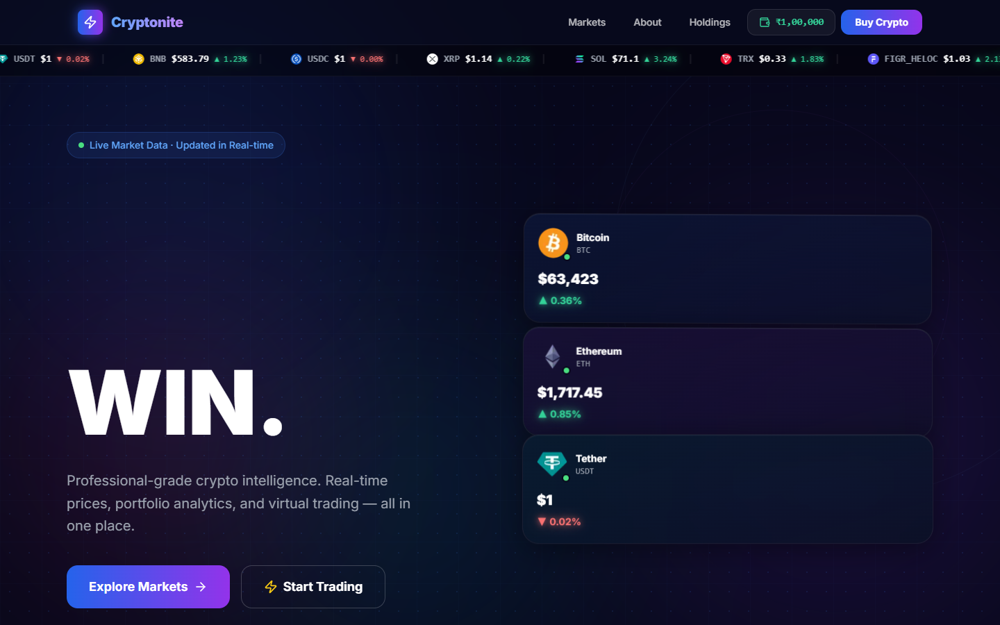
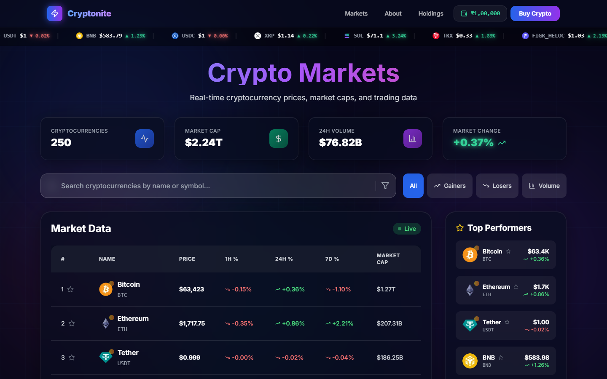
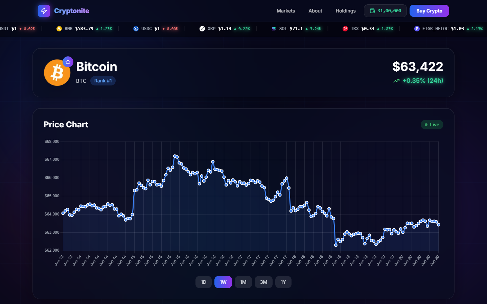
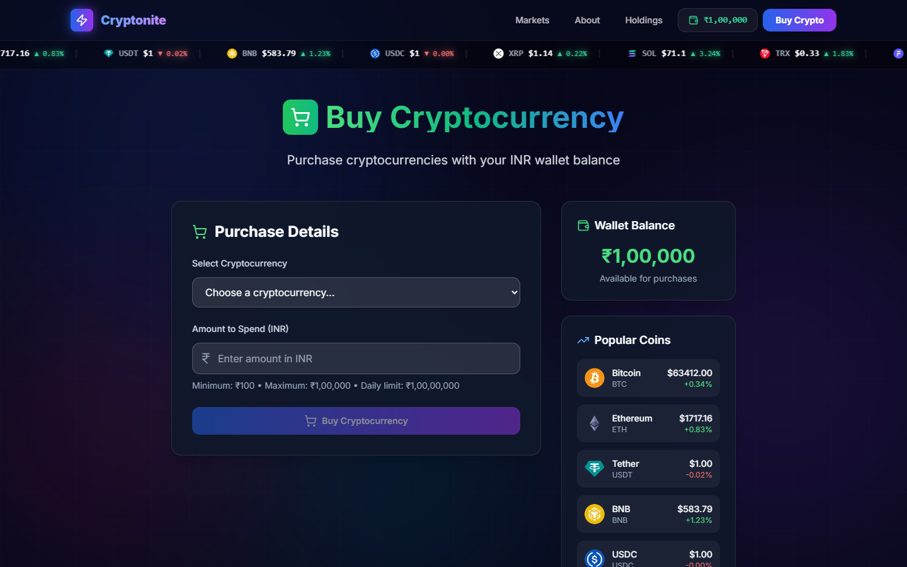
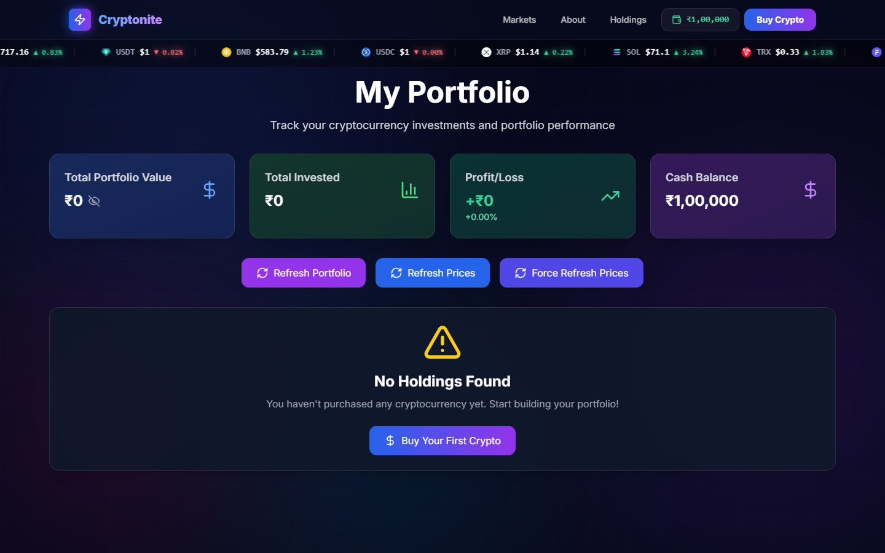

<div align="center">

# 🔐 Cryptonite

### *Your gateway to the crypto universe*

[](https://nextjs.org/)
[](https://reactjs.org/)
[](https://tailwindcss.com/)
[](https://developer.mozilla.org/en-US/docs/Web/JavaScript)
[](https://cryptonite-seven-phi.vercel.app)

A full-featured cryptocurrency market tracker and virtual trading simulator — live prices, interactive charts, portfolio management, and a virtual wallet. Built with real-world engineering patterns: server-side caching, rate-limit fallbacks, and a premium glassmorphism UI with 3D animations.

### 🌐 [Live Demo → cryptonite-seven-phi.vercel.app](https://cryptonite-seven-phi.vercel.app)

</div>

---

## 📸 Screenshots

| Home | Markets |
|:---:|:---:|
|  |  |

| Coin Detail | Buy Crypto |
|:---:|:---:|
|  |  |

<div align="center">

| Portfolio |
|:---:|
|  |

</div>

---

## ✨ Features

| Feature | Details |
|---|---|
| 📡 **Live Market Data** | Real-time prices, market caps, and volume via CoinGecko API |
| 📊 **Dual Chart Libraries** | Recharts for market overviews + Chart.js for deep coin analysis |
| 💼 **Virtual Trading** | Start with ₹1,00,000 and practice buying crypto risk-free |
| 📈 **Portfolio Tracker** | Track holdings, average buy price, and live P&L |
| 🔍 **Smart Search & Filter** | Filter across hundreds of coins instantly — gainers, losers, volume |
| 🛡️ **Rate-Limit Resilient** | Multi-layer fallback: cache → API → stale cache → JSON file → hardcoded |
| 🎞️ **Live Price Ticker** | Scrolling ticker bar with real-time prices across all coins |
| 🌀 **3D Tilt Cards** | Mouse-tracking 3D perspective tilt effect on interactive cards |
| 🌙 **Glass-Premium UI** | Animated orbs, cyber grid, neon borders, scan-line hover effects |

---

## 🖥️ Pages

```
/               → Market Dashboard   — Hero, global stats, trending coins, top performers
/ProductsPage   → Full Market Table  — Sortable list with sparkline charts + pagination
/coins/[id]     → Coin Detail        — Price history charts (1D/1W/1M/3M/1Y), ATH/ATL, metrics
/buy            → Buy Crypto         — Simulate purchases with your virtual wallet
/portfolio      → My Holdings        — Live P&L, cost basis, CSV export
/AboutPage      → About              — The story behind Cryptonite
```

---

## 🚀 Getting Started

### Prerequisites

- **Node.js** v18+
- **npm** or **yarn**

### Installation

```bash
# 1. Clone the repo
git clone https://github.com/harshcode1/Cryptonite.git
cd Cryptonite

# 2. Install dependencies
npm install

# 3. Start the dev server
npm run dev
```

Open [http://localhost:3000](http://localhost:3000) — you're live.

### Production Build

```bash
npm run build
npm start
```

---

## 🏗️ Project Structure

```
Cryptonite/
├── app/
│   ├── layout.js                  # Root layout — Navbar, TickerBar, animated orbs
│   ├── page.js                    # Home dashboard with 3D hero section
│   ├── globals.css                # Tailwind + glass-premium design system
│   │
│   ├── components/
│   │   ├── Navbar.js              # Sticky nav with live wallet balance pill
│   │   ├── Footer.js              # Glass backdrop footer
│   │   ├── TickerBar.js           # Live scrolling price ticker
│   │   ├── TiltCard.js            # 3D mouse-tracking tilt card wrapper
│   │   ├── Markettable.js         # Coin table with inline sparklines
│   │   ├── Sidebar.js             # Top performers sidebar
│   │   ├── Searchbar.js           # Live search/filter input
│   │   ├── Pagination.js          # Smart pagination component
│   │   ├── Chart.js               # Reusable chart wrapper
│   │   └── card.js                # Base card primitives
│   │
│   ├── api/
│   │   ├── coins/route.js         # GET /api/coins — paginated market data (5min cache)
│   │   ├── price/route.js         # GET /api/price — current prices (5min cache)
│   │   ├── coin/[id]/route.js     # GET /api/coin/:id — full coin details (1min cache)
│   │   ├── chart/[id]/route.js    # GET /api/chart/:id — historical price data (5min cache)
│   │   ├── global/route.js        # GET /api/global — global market stats (5min cache)
│   │   └── trending/route.js      # GET /api/trending — trending coins (5min cache)
│   │
│   ├── ProductsPage/page.js       # Full market listing
│   ├── buy/page.js                # Virtual trading desk
│   ├── portfolio/page.js          # Holdings + P&L dashboard
│   ├── coins/[id]/page.js         # Individual coin deep-dive
│   ├── AboutPage/page.js          # About page
│   └── not-found.js               # Custom 404
│
├── data/
│   └── coins.json                 # Fallback cache for API rate limits
│
├── public/                        # Static assets
├── tailwind.config.js
├── next.config.mjs
└── package.json
```

---

## 🔌 API Routes

All routes are server-side proxies with **in-memory caching** keyed by query parameters. On CoinGecko rate limits (HTTP 429), responses fall back through: stale cache → `data/coins.json` → hardcoded defaults — so the app never goes dark.

| Endpoint | Cache TTL | Description |
|---|---|---|
| `GET /api/coins?page=1&per_page=50` | 5 min | Paginated market data with sparklines |
| `GET /api/price?ids=bitcoin,ethereum` | 5 min | Current prices for specified coins |
| `GET /api/coin/:id` | 1 min | Full details: description, links, ATH, supply |
| `GET /api/chart/:id?days=7` | 5 min | Price history for charting (1D/1W/1M/3M/1Y) |
| `GET /api/global` | 5 min | Global market cap, volume, BTC dominance |
| `GET /api/trending` | 5 min | Trending coins from CoinGecko |

---

## ⚙️ Technical Highlights

**Server-side API proxying**
All CoinGecko calls go through Next.js API routes — no API keys exposed to the browser, no CORS issues, and every response is cached server-side.

**Multi-layer rate-limit fallback**
When CoinGecko returns HTTP 429: serve stale cache if available, fall back to `data/coins.json` (written on every successful fetch), then fall back to hardcoded baseline data. The UI always has something to show.

**Race condition prevention**
Chart tab switching (1D → 1W → 1M etc.) uses `AbortController` — each new fetch aborts the previous in-flight request, so fast tab clicks never render stale data out of order.

**Cross-component wallet sync**
Navbar wallet balance updates instantly after a purchase without prop drilling or a global store — achieved via a custom `walletUpdated` DOM event dispatched from the buy page and listened to in the Navbar.

**3D tilt effect**
`TiltCard` uses `getBoundingClientRect` + CSS `perspective` + `rotateX/rotateY` to compute a real-time 3D tilt angle from the mouse position relative to the card — zero dependencies, pure CSS transforms.

**Animated background system**
Four independently animated radial gradient orbs (`position: fixed`) + a CSS grid overlay layer — all driven by `@keyframes` with staggered durations (16s–24s) so no two orbs sync up.

---

## 💡 Tech Stack

| Layer | Technology | Why |
|---|---|---|
| Framework | **Next.js 14** (App Router) | File-based routing, API routes, image optimization |
| UI | **React 18** | Hooks-based component model, no unnecessary re-renders |
| Styling | **Tailwind CSS 3.4** | Utility-first, pairs cleanly with custom CSS animations |
| Charts | **Recharts** + **Chart.js** | Area charts for overview; line charts for coin detail |
| HTTP | **Axios** | Clean promise API on the client side |
| Icons | **Lucide React** | Consistent, tree-shakable SVG icons |
| Data Source | **CoinGecko API** (Free tier) | Comprehensive global coin data, no auth required |
| Deployment | **Vercel** | Zero-config Next.js hosting |

---

## 💼 Virtual Portfolio System

A fully simulated trading engine stored in `localStorage` — no backend, no real money.

- **Starting balance:** ₹1,00,000
- **Min purchase:** ₹100 &nbsp;|&nbsp; **Max purchase:** ₹1,00,00,000
- **INR → USD conversion:** fixed 83:1 rate
- **Tracked per holding:** quantity · avg buy price · total spent (INR & USD) · purchase date
- **Live metrics:** current value · unrealized P&L · % return
- **Export:** one-click CSV download of all holdings

---

## 🎨 Design System

Built around a **dark glass-premium** aesthetic with motion:

- **Background:** Deep `#07071a` base + 4 animated radial gradient orbs (blue, purple, cyan, pink) + CSS cyber grid overlay
- **Cards:** `glass-premium` — `rgba(8,12,30,0.65)` background + `backdrop-blur(24px)` + neon border glow
- **Neon accents:** `.neon-green` / `.neon-red` with `text-shadow` glow for price changes
- **Motion:** Hero text staggered entrance, shimmer gradient text, 3D float animations on coin cards, scan-line hover effect on cards
- **Ticker:** CSS `@keyframes` infinite scroll at 45s, pauses on hover

---

## 📦 Key Dependencies

```json
{
  "next": "14.2.5",
  "react": "^18",
  "recharts": "^2.13.0",
  "react-chartjs-2": "^5.2.0",
  "axios": "^1.7.2",
  "lucide-react": "^0.453.0",
  "@radix-ui/react-slot": "^1.1.0",
  "tailwindcss": "^3.4.1"
}
```

---

## 🤝 Contributing

1. Fork the repo
2. Create a feature branch: `git checkout -b feature/amazing-feature`
3. Commit your changes: `git commit -m "Add amazing feature"`
4. Push to the branch: `git push origin feature/amazing-feature`
5. Open a Pull Request

---

## 📄 License

Distributed under the **MIT License**.

---

<div align="center">

Built with ❤️ by [harshcode1](https://github.com/harshcode1)

*Powered by [CoinGecko API](https://www.coingecko.com/en/api) · Deployed on [Vercel](https://cryptonite-seven-phi.vercel.app)*

</div>
